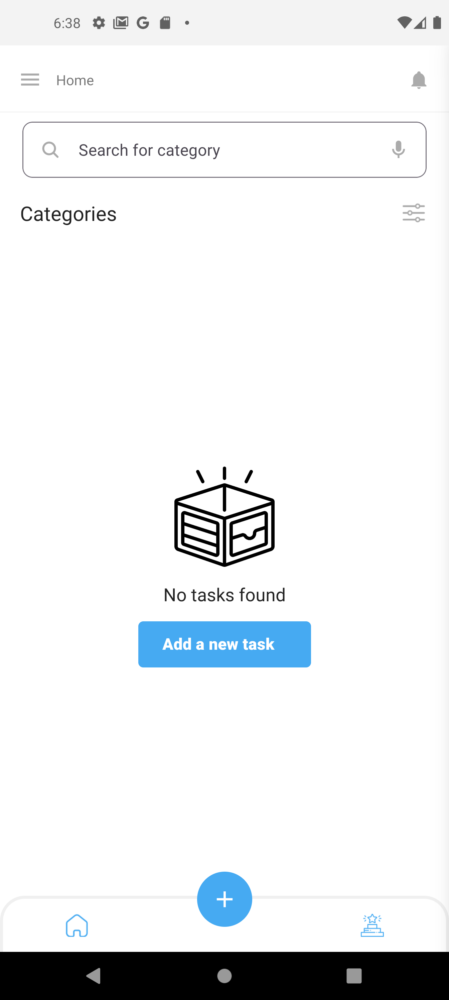

# TaskMaster Pro - Advanced Todo Application

This advanced todo application was developed as a university assignment to demonstrate mobile application development skills. TaskMaster Pro provides students with a comprehensive tool to manage their academic tasks, goals, and subjects through an intuitive and feature-rich interface.

## Project Overview

TaskMaster Pro was designed and implemented from the ground up to address the unique needs of university students:

- Track and prioritize assignments across multiple courses
- Set and monitor academic goals
- Organize tasks by subjects and categories
- Receive timely notifications for upcoming deadlines

## Key Features

### Comprehensive Task Management
- Create detailed tasks with title, description, priority, and deadlines
- Set custom reminders for important assignments
- Mark tasks as in-progress or completed
- Filter and sort tasks by various attributes (date, priority, subject)

### Subject Organization
- Create and manage academic subjects/courses
- Group tasks by subject for better organization
- Color-code subjects for visual distinction
- Track workload and progress per subject

### Goal Setting & Tracking
- Define short-term and long-term academic goals
- Set measurable targets with specific deadlines
- Monitor progress with visual indicators
- Receive achievement notifications upon completion

### Intuitive User Interface
- Clean, modern design with intuitive navigation
- Dashboard with key metrics and upcoming deadlines
- Dark/light mode support
- Responsive layout for various device sizes

## Technical Implementation

### Frontend Development
- Built with React Native for true cross-platform functionality
- Implemented Redux for efficient state management
- Utilized React Navigation for seamless screen transitions
- Applied custom UI components for consistent user experience
- Implemented offline data persistence

### Backend Architecture
- Developed a Node.js backend with RESTful API endpoints
- Implemented MongoDB for flexible data storage
- Integrated JWT authentication for secure access
- Created a real-time notification system

## Screenshots

### Login Screen

*Secure authentication system with password recovery*

### Home Dashboard

*Main dashboard showing upcoming tasks and priorities*

### Task Creation

*Detailed task creation with multiple options*

### Goals Tracking

*Goal management interface with progress tracking*

### User Profile

*User profile and application settings*

## Development Process

The application was developed following a structured approach:

1. **Requirements Analysis**: Identified key features needed for an effective academic task management system
2. **Design Phase**: Created wireframes and planned the application architecture
3. **Frontend Development**: Built the React Native components and implemented state management
4. **Backend Implementation**: Developed the server, API endpoints, and database schema
5. **Integration**: Connected frontend and backend systems
6. **Testing**: Conducted user acceptance testing and fixed identified issues
7. **Optimization**: Enhanced performance and user experience

## Installation and Setup

### Prerequisites
- Node.js (v14 or later)
- npm or yarn
- React Native development environment

### Mobile App Setup
1. Clone the repository
2. Navigate to the Mobile-Frontend directory:
   ```
   cd Mobile-Frontend
   ```
3. Install dependencies:
   ```
   npm install
   ```
4. Start the development server:
   ```
   npm start
   ```
5. Run on Android or iOS:
   ```
   npm run android
   ```
   or
   ```
   npm run ios
   ```

### Backend Setup
1. Navigate to the Node-Backend directory:
   ```
   cd Node-Backend
   ```
2. Install dependencies:
   ```
   npm install
   ```
3. Configure environment variables:
   ```
   cp env.example .env
   ```
4. Start the server:
   ```
   npm start
   ```

## Technologies Used

- **Frontend**: React Native, Redux, React Navigation
- **Backend**: Node.js, Express.js, MongoDB
- **Authentication**: JWT, bcrypt
- **Communication**: RESTful API, Axios
- **Development Tools**: Git, ESLint, Prettier

## Future Enhancements

Planned features for future versions include:

- Calendar integration with academic schedules
- Collaborative group project management
- AI-powered task prioritization
- Extended analytics on productivity and time management
- Cross-device synchronization

## Project Reflection

This project provided valuable experience in:
- Full-stack mobile application development
- User experience design for productivity applications
- Implementation of secure authentication systems
- Effective data modeling for task management applications 